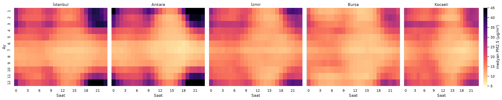
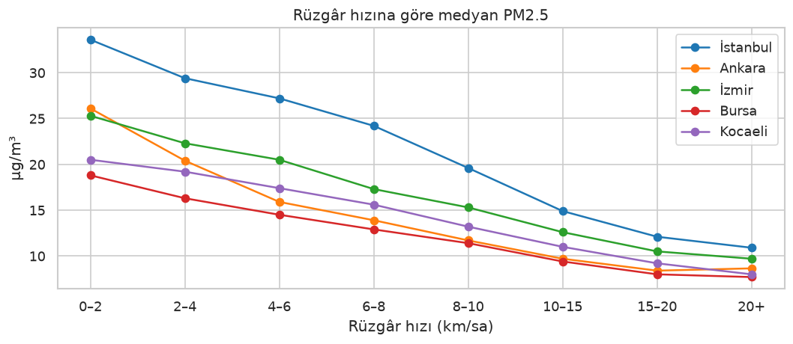
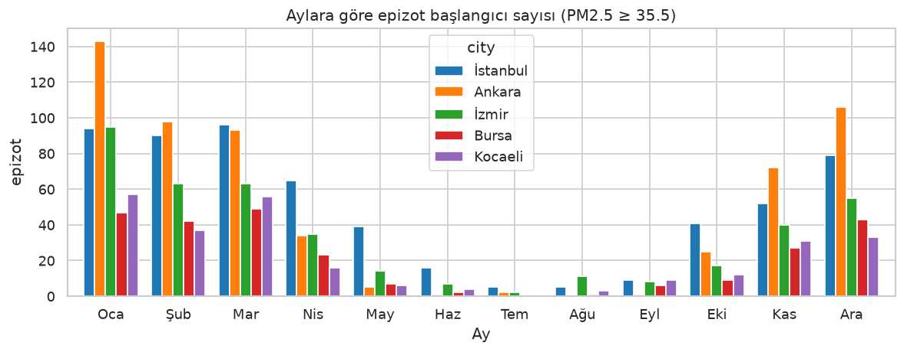

# 🌫️ HavaUyarı: Akıllı Hava Kalitesi Erken Uyarı Sistemi

[](https://github.com/TolgaARSLANN/havauyari/actions/workflows/ci.yml)


Türkiye şehirlerindeki hava kalitesi izleme istasyonlarında **24 saat sonra ölçülecek PM2.5 değerini tahmin eden**, bu tahmini hava kalitesi indeksi (AQI) kategorisine çeviren ve sağlıksız düzeyler için **erken uyarı** üreten, uçtan uca bir makine öğrenmesi projesi.

> 🚧 Geliştirme sürüyor: Veri, keşif, modelleme, tahmin servisi ve pano tamamlandı; otomasyon ve yayına alma aşamaları devam ediyor. Ayrıntılı plan: [docs/YOL_HARITASI.md](docs/YOL_HARITASI.md)

## Problem
Hava kirliliği, özellikle kış aylarında Türkiye şehirlerinde ciddi bir halk sağlığı sorunudur. Mevcut sistemler çoğunlukla *şu anki* durumu gösterir. HavaUyarı ise *yarın ne olacağını* tahmin ederek hassas grupların (astım hastaları, yaşlılar, çocuklar) önlem almasına yardımcı olmayı hedefler.

Avrupa'nın CAMS atmosfer modeli hava kalitesi tahmini yayımlıyor; ancak yaklaşık 11 km'lik çözünürlüğü yerel gerçeği zayıf yansıtıyor: İstasyon ölçümleriyle korelasyonu 0,30–0,64 arasında kalıyor ve sapması şehirden şehre ters yönde değişiyor (Ankara'da olduğundan yüksek, Bursa ve İzmir'de olduğundan düşük tahmin). **Bu proje, genel modeli yerel istasyon ölçümleri ve hava tahminiyle düzelterek gerçek ölçüme yakın bir erken uyarı üretir.**

## Veri
| Kaynak | Rol | İçerik |
|---|---|---|
| **Çevre, Şehircilik ve İklim Değişikliği Bakanlığı SİM** (sim.csb.gov.tr) | **Hedef** | 8 kentsel istasyonda saatlik PM2.5 ölçümü |
| [Open-Meteo Air Quality API](https://open-meteo.com/en/docs/air-quality-api) (CAMS) | Girdi | İstasyon koordinatında PM2.5, PM10, NO₂, O₃, CO, SO₂ |
| [Open-Meteo Previous Runs API](https://open-meteo.com/en/docs/previous-runs-api) | Girdi | *O gün yayımlanmış*, bir gün sonrasına ait hava tahminleri |
| [Open-Meteo Historical Weather API](https://open-meteo.com/en/docs/historical-weather-api) (ERA5) | Girdi | Gerçekleşen sıcaklık, nem, rüzgâr, basınç ve yağış |

- **Şehirler:** İstanbul, Ankara, İzmir, Bursa, Kocaeli · **Kapsam:** 1 Ocak 2023'ten bugüne, saatlik
- **İstasyon seçimi:** 104 istasyon tarandı; bunların 47'si PM2.5 ölçüyor. Kentsel, sanayi kaynaklı olmayan ve veri doluluğu en az %80 olan istasyonlardan şehir başına en fazla 2 istasyon seçildi ([kapsam raporu](reports/istasyon_kapsami.md)).
- **Kalite:** Ölçülmemiş saatler hedef olarak kullanılmaz ve tahminle doldurulmaz. Temizlik kuralları ve saat hizası doğrulaması: [istasyon veri kalitesi](reports/istasyon_veri_kalitesi.md), [CAMS veri kalitesi](reports/veri_kalite_raporu.md)

## Veriden Öğrendiklerimiz
Tam analiz: [notebooks/01_eda.ipynb](notebooks/01_eda.ipynb)

1. **Kirlilik kışın ve akşam saatlerinde yoğunlaşıyor.** Uyarı düzeyindeki (≥ 35,5 µg/m³) kirlilik olaylarının %70–88'i Kasım–Mart döneminde başlıyor. Kış akşamlarında (20.00–22.00) PM2.5, öğleden sonraya göre 2,4–4,3 kat yüksek.
2. **Rüzgâr, en güçlü meteorolojik etken.** Durgun havada PM2.5, saatte 20 km'yi aşan rüzgâra göre 2,4–3,1 kat yüksek. Rüzgârın yönü de önemli: İstanbul'da doğu-güneydoğu rüzgârında kirlilik, kuzeydoğu rüzgârına göre yaklaşık 2,8 kat yüksek.
3. **Yağış havayı temizliyor.** Son 3 saatte yağış olduğunda PM2.5 medyanı %17–25 daha düşük.
4. **Asıl zorluk, yeni başlayan kirlilik.** 24 saat sonraki uyarı saatlerinin %37–64'ü, şu anda uyarı olmayan saatlerden geliyor. "Yarın da bugün gibi olur" diyen bir model bunları kaçırır; bu yüzden meteorolojik özellikler ve hava tahmini kritik önemde.
5. **Kirlilik olayları kısa sürüyor.** Uyarı düzeyindeki bir olay genellikle 4–5 saat, en uzun durumda 90 saat sürüyor.

<p align="center">
  <br>
  <em>Ay ve saate göre medyan PM2.5: Kış akşamlarındaki koyu bölge, ısınma kaynaklı kirliliği gösteriyor.</em>
</p>

<p align="center">
  
  <br>
  <em>Solda: Rüzgâr hızı arttıkça PM2.5 düşüyor. Sağda: Kirlilik olayları kış aylarında yoğunlaşıyor.</em>
</p>

## Yaklaşım
- **Özellikler (99):** İstasyon ölçümünün geçmişi (1 saat ile 1 hafta arasındaki gecikmeli değerler, kayan istatistikler, hedef saatle hizalanmış geçmiş değerler), CAMS kirletici verileri, meteoroloji (rüzgâr vektörü ve durgunluk, yağış birikimi, ısıtma derece-saati, basınç ve sıcaklık değişimi), takvim ve Türkiye'nin resmî tatilleri ile **o gün yayımlanmış hava tahmininden** üretilen 17 özellik (önümüzdeki 24 saatin yağış toplamı, durgun saat sayısı, en zayıf rüzgâr vb.).
- **Veri sızıntısına karşı önlemler:** Eksik saatler yalnızca geçmiş değerle doldurulur; hedef değer hiç doldurulmaz. Testler, belirli bir andan sonraki veri değiştirildiğinde hiçbir özelliğin değişmediğini doğrular. Hava tahminlerinde yalnızca tahmin anında yayımlanmış olan dönem kullanılır.
- **Referans modeller (baseline):** Persistence ("yarın da bugün gibi"), bir hafta önceki aynı saat, 24 saatlik hareketli ortalama, klimatoloji (istasyon, ay ve saate göre medyan), ham CAMS ve ölçeklenmiş CAMS.
- **Model:** LightGBM
- **Doğrulama:** Son 1 yıl üzerinde 12 aylık, ileriye kayan pencereli (walk-forward) geri test; genişleyen eğitim penceresi ve arındırma (purge) ile her mevsim ayrı ayrı sınanır. Rastgele bölme (random split) kullanılmaz; tüm modeller aynı satırlar üzerinde karşılaştırılır.
- **Metrikler:** MAE, RMSE, sMAPE; uyarılar için **recall** (kaçırılan alarm en kritik hatadır) ve precision.
- **AQI:** US EPA'nın 2024 PM2.5 eşikleri. Ana uyarı eşiği: 35,5 µg/m³ (hassas gruplar için sağlıksız).

## Kurulum ve Çalıştırma
Linux, macOS veya WSL üzerinde:
```bash
python3 -m venv .venv && source .venv/bin/activate
pip install -e ".[dev]"

# Ana akış: istasyon hedefi
make sim-survey    # SİM istasyonlarını tara -> reports/istasyon_kapsami.md
make sim-data      # seçili istasyonların saatlik ölçümleri
make forecasts     # geçmişte yayımlanmış hava tahminleri
make stations      # birleşik veri seti ve kalite raporu
make train-station # istasyon hedefli geri test -> reports/backtest_istasyon_h24.md

# Yan akış: CAMS hedefli ilk kurulum (karşılaştırma için korunuyor)
make data quality process
make train

make final         # final model ve açıklanabilirlik -> models/, reports/aciklanabilirlik_h24.md
make test          # birim ve uçtan uca testler (121)
```

## Tahmin API'si
```bash
pip install -e ".[api]"
make final   # model dosyasını üretir (Git'e eklenmez; yaklaşık 2 dakika sürer)
make api     # http://127.0.0.1:8000/docs
```

```bash
curl http://127.0.0.1:8000/forecast/izmir_konak
```

Örnek yanıt (kısaltılmış; 23 Eylül 2026, 13.00):
```json
{
  "station": "izmir_konak",
  "issued_at": "2026-09-23T13:00:00",
  "target_time": "2026-09-24T13:00:00",
  "pm25": 23.7,
  "interval_80": {"low": 11.6, "high": 37.8},
  "aqi": 78,
  "category": "Orta",
  "alert": {"is_alert": false, "decision_threshold": 32.0, "official_threshold": 35.5, "risk": true},
  "explanation": {
    "base_value": 19.47,
    "top_features": [
      {"feature": "station_pm25", "family": "istasyon PM2.5 geçmişi", "value": 31.34, "contribution": 4.12},
      {"feature": "fc_win_wind_mean", "family": "hava tahmini (o gün yayımlanan)", "value": 9.17, "contribution": -3.12}
    ]
  }
}
```
Uç noktalar: `/health`, `/stations`, `/forecast/{station}`, `/alerts?only_alerts=true`. Aynı saat içinde tekrarlanan istekler önbellekten yanıtlanır.

## Pano
```bash
pip install -e ".[api,ui]"
make ui      # http://localhost:8501
```
- **Genel bakış:** İstasyonlar Türkiye haritasında yarınki tahmin kategorisinin rengiyle gösterilir; uyarı ve uyarı riski sayıları, istasyon kartları ve tablo görünümü yer alır.
- **İstasyon detayı:** 24 saat sonrası için tahmin, %80'lik aralık, uyarı durumu ve genel sağlık bilgilendirmesi; son 72 saatin ölçümü, aynı saatler için verilmiş tahminler ve önümüzdeki 24 saatin tahmin eğrisi; "Bu tahmin neden böyle?" açıklaması.
- **Model performansı:** Geri test sonuçları, uyarı dengesi ve kalibrasyon grafikleri.
- Açık ve koyu tema desteklenir; metinler Türkçe yazım kurallarına, renk kontrastları erişilebilirlik ölçütlerine (WCAG AA) uygundur.

## Proje Yapısı
```
src/havauyari/
├─ data/        # veri çekme (SİM, Open-Meteo), kalite raporları, temizlik
├─ features/    # zaman serisi ve hava tahmini özellikleri
├─ models/      # referans modeller, geri test, deneyler, aralıklar, final model
├─ evaluation/  # ileriye kayan pencereli geri test çerçevesi, metrikler, hata analizi
├─ alerts/      # AQI dönüşümü, uyarı eşikleri
├─ serving/     # canlı veri, tahmin akışı, FastAPI uygulaması
├─ ui/          # Streamlit panosu ve tasarım sistemi
└─ config.py
models/         # model kartı, istasyon listesi, eşik ve aralık tabloları (model dosyası Git'e eklenmez)
notebooks/      # keşifsel veri analizi (EDA)
reports/        # kalite, geri test, hata analizi, deney ve açıklanabilirlik raporları
docs/           # yol haritası
tests/          # birim ve uçtan uca testler (sızıntı, geri test, API, pano)
```

## Sonuçlar
**Hedef: istasyonda 24 saat sonra ölçülecek PM2.5.** Son 1 yıl (23 Eylül 2025 – 18 Eylül 2026), 12 aylık ileriye kayan pencereli geri test, 8 istasyon, 501.000 tahmin. Tüm modeller aynı satırlar üzerinde ölçülür. Uyarı: PM2.5 ≥ 35,5 µg/m³.

| Model | MAE | RMSE | Uyarı recall | Uyarı precision |
|---|---|---|---|---|
| **HavaUyarı (uygulanabilir)** | **6,78** | **10,78** | **0,66** | **0,73** |
| HavaUyarı (üst sınır) | 6,50 | 10,45 | 0,68 | 0,73 |
| Hareketli ortalama (24 saat) | 9,09 | 14,12 | 0,57 | 0,61 |
| Persistence ("yarın da bugün gibi") | 9,09 | 14,51 | 0,60 | 0,60 |
| Klimatoloji (istasyon, ay ve saate göre) | 10,30 | 17,03 | 0,05 | 0,36 |
| CAMS (istasyon ortalamasına ölçeklenmiş) | 11,15 | 17,32 | 0,41 | 0,47 |
| Bir hafta önceki aynı saat | 11,61 | 18,32 | 0,49 | 0,49 |
| **Ham CAMS** | 12,95 | 19,73 | 0,25 | 0,36 |

- Ortalama hata, ham CAMS'a göre **%47,7**, en iyi basit referans modele göre **%25,4** daha düşük.
- Uyarıların yakalanma oranı 0,25'ten **0,66'ya** çıkarken isabet de 0,36'dan **0,73'e** yükseliyor: Hem daha çok uyarı yakalanıyor hem de daha az yanlış alarm veriliyor.
- **Uyarı eşiği ayarı:** Model zirveleri bastırdığı için karar eşiği, yakalama oranı en az %80 olacak şekilde *yalnızca geçmiş tahminlerden* seçildi (28,5 µg/m³). Son 12 ayda uyarıların **%82,4'ü** yakalandı (35,5'lik sabit eşikle %65,7). Bunun bedeli daha fazla yanlış alarmdır: İsabet %73'ten %57'ye iniyor. [Ayrıntılar](reports/uyari_esigi_h24.md)
- **Yeni başlayan kirlilik:** 24 saat sonra başlayacak uyarıların %34'ü önceden öngörülebiliyor ("yarın da bugün gibi" yönteminde %0, CAMS'ta %26). [Hata analizi](reports/hata_analizi_istasyon_h24.md)
- **İstasyon bazlı eşik:** Her istasyonun kendi eşiği var (18,5–32 µg/m³); en zayıf istasyondaki yakalama oranı %39'dan %71'e çıktı.
- **Tahmin aralığı:** Her tahmine %80'lik bir aralık eşlik eder (örneğin "29 µg/m³; %80 olasılıkla 17–45 arasında"). Son 12 ayda gerçek değerlerin %82,9'u bu aralıkta kaldı. [Ayrıntılar](reports/tahmin_araligi_h24.md)
- **Açıklanabilirlik:** Tahminin %30'u o gün yayımlanan hava tahmininden, %36'sı istasyonun geçmiş ölçümlerinden geliyor; CAMS'ın PM2.5 değerinin payı yalnızca %0,6. Her tahmin için "neden" açıklaması üretilebiliyor. [Ayrıntılar](reports/aciklanabilirlik_h24.md)
- **Uygulanabilirlik:** Ana model yalnızca tahmin anında erişilebilen verileri kullanır (istasyon geçmişi, CAMS'ın o ana kadarki değerleri, o gün yayımlanmış hava tahmini). "Üst sınır" modeli ise ek olarak CAMS'ın gelecekteki değerlerini görür. Aradaki farkın küçük olması, sonucun CAMS'ın tahmin başarısına bağlı olmadığını gösteriyor.
- İstasyon ve mevsim kırılımları: [reports/backtest_istasyon_h24.md](reports/backtest_istasyon_h24.md)

## Yol Haritası
Ayrıntılı alt aşamalar ve alınan kararlar: [docs/YOL_HARITASI.md](docs/YOL_HARITASI.md)

- [x] Geliştirme ortamı ve sürekli entegrasyon (CI)
- [x] Veri toplama, kalite raporu, temizlik
- [x] Keşifsel veri analizi (EDA)
- [x] Özellik mühendisliği (meteoroloji, tatiller, diğer kirleticiler)
- [x] Gerçek istasyon ölçümlerine (SİM) geçiş ve hava tahmini özellikleri
- [x] Modelleme ve geri test: Ham CAMS'a göre MAE %47,7 daha düşük
- [x] Hata analizi, istasyon bazlı uyarı eşiği, tahmin aralıkları, açıklanabilirlik (SHAP), final model
- [x] Deney takibi: MLflow yerine hafif kayıt (`reports/deney_kaydi.csv` ve `models/model_card.json`)
- [ ] Optuna ile hiperparametre araması (isteğe bağlı; zirve deneyi, sınırın parametrelerde değil bilgide olduğunu gösterdi)
- [x] Tahmin API'si (FastAPI): `/forecast/{station}`, `/alerts`, `/stations`, `/health`
- [x] Streamlit panosu: harita, tahmin grafiği ve %80'lik aralık, uyarı ve uyarı riski, "neden?" açıklaması, model performansı
- [ ] Docker ve GitHub Actions ile günlük otomatik tahmin
- [ ] Hugging Face Spaces'te yayına alma

## Sınırlamalar
- **Uyarı yakalama başarısı istasyondan istasyona değişiyor.** Tüm istasyonlar birlikte hesaplanan recall (0,66), uyarının sık görüldüğü istasyonlara daha fazla ağırlık verir. Sabit eşikle istasyon bazındaki recall 0,14 (İstanbul-Ümraniye, uyarı oranı %2,7) ile 0,79 (İzmir-Konak) arasında değişiyordu; istasyon bazlı eşiklerle en düşük değer 0,71'e yükseldi.
- **Ankara istasyonlarının verisine duyulan güven düşük.** İki Ankara istasyonunda kış gecesi ölçümleri şüpheli derecede düşük. Bu istasyonlar çıkarıldığında genel sonuç değişmiyor; sonuçları ayrıca raporlanıyor.
- **CAMS karşılaştırması, CAMS lehine iyimser.** Geçmiş CAMS tahmin arşivi erişime açık olmadığı için CAMS'ın analiz değerleri kullanıldı; gerçek bir 24 saatlik CAMS tahmini bundan daha hatalı olurdu.
- **Kapsam:** 5 şehirde 8 istasyon ve tek tahmin ufku (24 saat). Daha uzun ufuklar için iki gün ve daha önce yayımlanmış tahminlerin arşivi gerekiyor.

## Sorumluluk Reddi
Bu proje eğitim ve portföy amaçlıdır. Tahminler resmî hava kalitesi uyarılarının yerine geçmez ve tıbbi tavsiye niteliği taşımaz.
