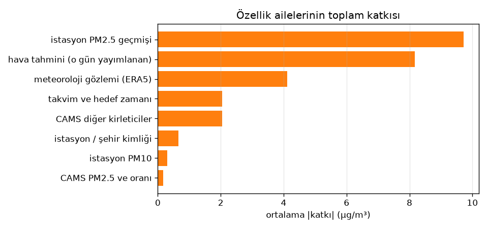
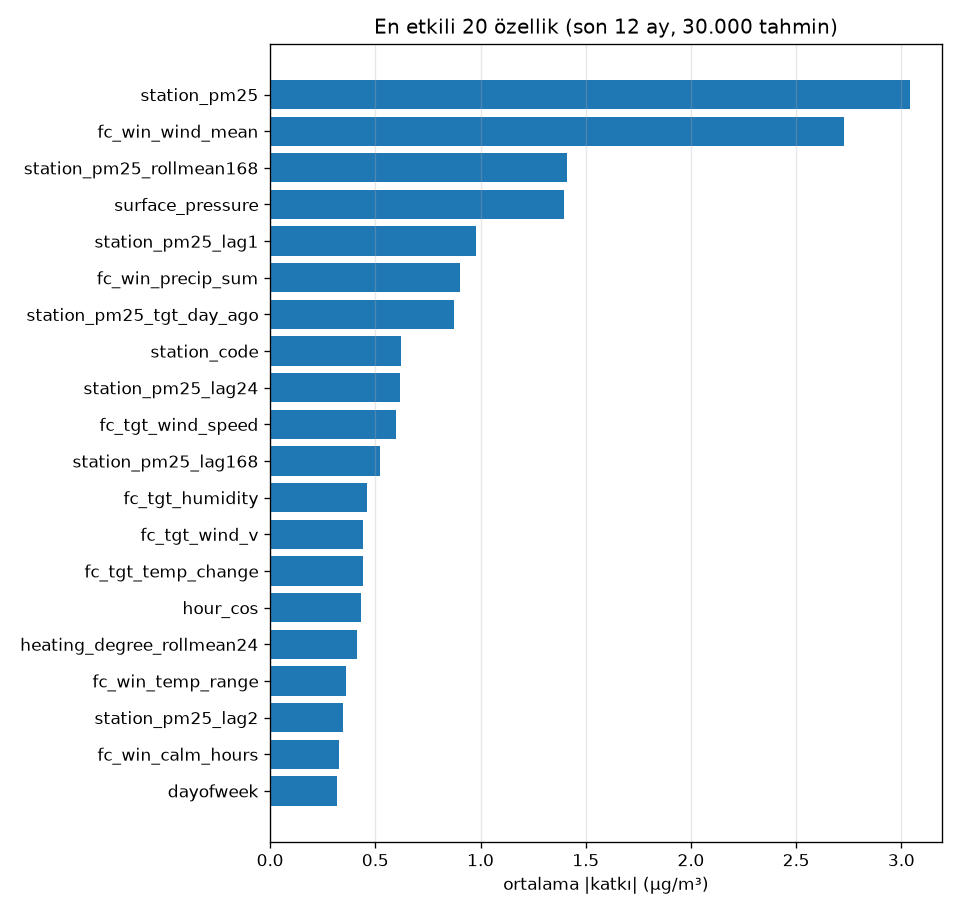
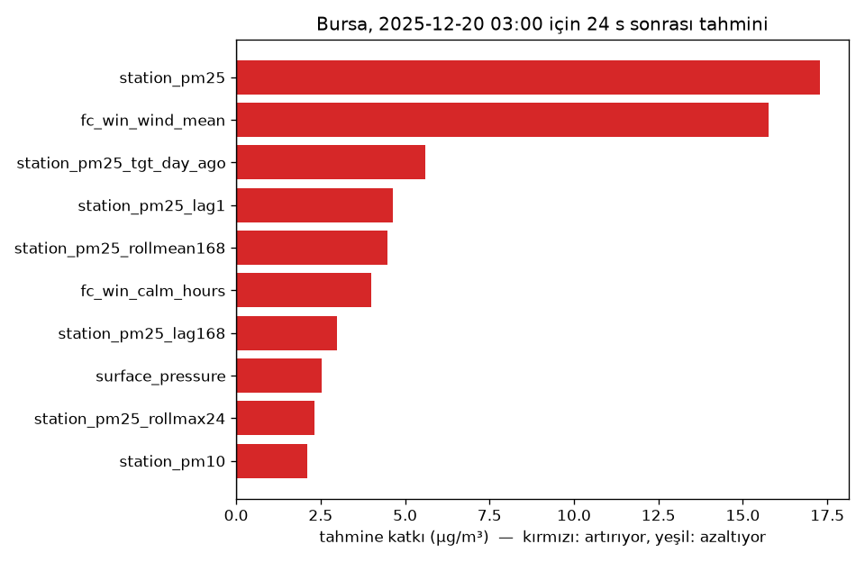

# Açıklanabilirlik: Final Model, 24 Saat

_Oluşturulma: 2026-09-23 · Üreten: `python -m havauyari.models.final`_

Katkılar LightGBM `pred_contrib` (TreeSHAP) ile hesaplandı: her tahmin = taban değer + özellik katkıları. Örnek: son 12 aydan 30.000 tahmin. Final model tüm veriyle eğitildiği için bu tablo modelin *neye dayandığını* gösterir, performans ölçüsü değildir.

## Özellik aileleri

| aile | toplam ort. |katkı| | pay % |
|---|---|---|
| istasyon PM2.5 geçmişi | 9.72 | 35.72 |
| hava tahmini (o gün yayımlanan) | 8.17 | 30.01 |
| meteoroloji gözlemi (ERA5) | 4.11 | 15.09 |
| takvim ve hedef zamanı | 2.05 | 7.53 |
| CAMS diğer kirleticiler | 2.04 | 7.49 |
| istasyon / şehir kimliği | 0.66 | 2.43 |
| istasyon PM10 | 0.31 | 1.13 |
| CAMS PM2.5 ve oranı | 0.16 | 0.60 |

## En etkili 20 özellik

| özellik | aile | ort. |katkı| | değer ↑ → tahmin |
|---|---|---|---|
| station_pm25 | istasyon PM2.5 geçmişi | 3.04 | artırır |
| fc_win_wind_mean | hava tahmini (o gün yayımlanan) | 2.73 | azaltır |
| station_pm25_rollmean168 | istasyon PM2.5 geçmişi | 1.41 | artırır |
| surface_pressure | meteoroloji gözlemi (ERA5) | 1.40 | artırır |
| station_pm25_lag1 | istasyon PM2.5 geçmişi | 0.98 | artırır |
| fc_win_precip_sum | hava tahmini (o gün yayımlanan) | 0.90 | azaltır |
| station_pm25_tgt_day_ago | istasyon PM2.5 geçmişi | 0.87 | artırır |
| station_code | istasyon / şehir kimliği | 0.62 | artırır |
| station_pm25_lag24 | istasyon PM2.5 geçmişi | 0.62 | artırır |
| fc_tgt_wind_speed | hava tahmini (o gün yayımlanan) | 0.60 | azaltır |
| station_pm25_lag168 | istasyon PM2.5 geçmişi | 0.52 | artırır |
| fc_tgt_humidity | hava tahmini (o gün yayımlanan) | 0.46 | artırır |
| fc_tgt_wind_v | hava tahmini (o gün yayımlanan) | 0.44 | azaltır |
| fc_tgt_temp_change | hava tahmini (o gün yayımlanan) | 0.44 | artırır |
| hour_cos | takvim ve hedef zamanı | 0.43 | azaltır |
| heating_degree_rollmean24 | meteoroloji gözlemi (ERA5) | 0.41 | artırır |
| fc_win_temp_range | hava tahmini (o gün yayımlanan) | 0.36 | artırır |
| station_pm25_lag2 | istasyon PM2.5 geçmişi | 0.34 | artırır |
| fc_win_calm_hours | hava tahmini (o gün yayımlanan) | 0.33 | artırır |
| dayofweek | takvim ve hedef zamanı | 0.32 | azaltır |

## Örnek açıklama

Bursa istasyonu, 2025-12-20 03:00 anında verilen 24 saat sonrası tahmini: **110.3 µg/m³** (gerçekleşen 127.0).

| özellik | değer | katkı (µg/m³) |
|---|---|---|
| station_pm25 | 79.00 | 17.27 |
| fc_win_wind_mean | 2.00 | 15.77 |
| station_pm25_tgt_day_ago | 79.00 | 5.61 |
| station_pm25_lag1 | 84.00 | 4.64 |
| station_pm25_rollmean168 | 52.57 | 4.47 |
| fc_win_calm_hours | 24.00 | 4.01 |
| station_pm25_lag168 | 66.00 | 2.99 |
| surface_pressure | 1011.30 | 2.54 |
| station_pm25_rollmax24 | 117.00 | 2.33 |
| station_pm10 |  | 2.10 |
| diğer özellikler |  | 29.11 |
| taban (ortalama) |  | 19.47 |

