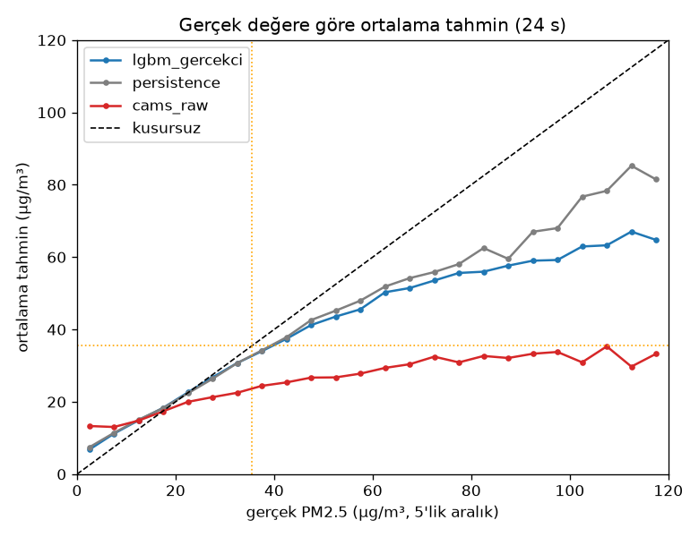
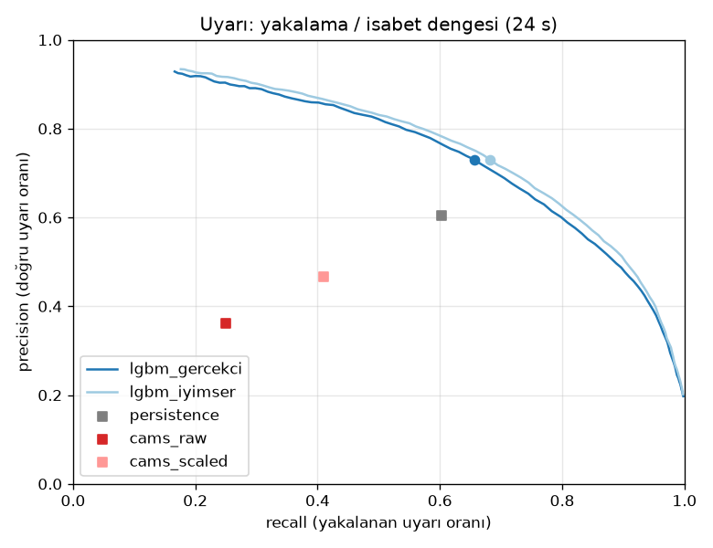

# Hata Analizi: İstasyon Hedefi, 24 Saat

_Oluşturulma: 2026-09-23 · Üreten: `python -m havauyari.evaluation.error_analysis` · Ana model: `lgbm_gercekci`_

## 1. Gerçek değere göre hata

Sapma = tahmin − gerçek. Negatif sapma yüksek değerlerde düşük tahmin demektir.

| gerçek PM2.5 | saat sayısı | MAE lgbm_gercekci | MAE persistence | MAE cams_raw | sapma lgbm_gercekci | sapma persistence | sapma cams_raw |
|---|---|---|---|---|---|---|---|
| 0–10 | 17561 | 4.20 | 5.54 | 8.62 | 3.59 | 3.98 | 7.96 |
| 10–20 | 20490 | 4.53 | 6.71 | 7.78 | 1.66 | 1.80 | 1.10 |
| 20–35,5 | 15107 | 6.80 | 9.64 | 13.12 | -0.72 | -0.95 | -5.41 |
| 35,5–55,5 | 5969 | 11.38 | 16.16 | 23.15 | -5.66 | -4.92 | -18.05 |
| ≥55,5 | 3498 | 24.91 | 26.55 | 46.85 | -22.87 | -18.25 | -45.26 |

## 2. Yeni başlayan ve süren uyarılar

Yeni başlayan: t anında istasyonda uyarı yok, t+24'te var. Persistence bunları tanım gereği kaçırır; erken uyarının asıl değeri burada.

| uyarı türü | uyarı saati | recall lgbm_gercekci | recall persistence | recall cams_raw |
|---|---|---|---|---|
| YENİ başlayan | 3765.000 | 0.343 | 0.000 | 0.262 |
| süren | 5702.000 | 0.862 | 1.000 | 0.241 |

## 3. Kaçırılan uyarılar

| model | gerçek uyarı | kaçırılan | kaçırılanlarda medyan tahmin | tahmin ≥ 30 olan kaçırılan % | tahmin ≥ 25 olan kaçırılan % |
|---|---|---|---|---|---|
| lgbm_gercekci | 9467.0 | 3258.0 | 28.7 | 41.3 | 70.0 |
| persistence | 9467.0 | 3765.0 | 25.0 | 29.1 | 52.1 |
| cams_raw | 9467.0 | 7104.0 | 18.1 | 11.4 | 25.3 |

## 4. Karar eşiği dengesi (tanımlayıcı)

Test verisi üzerinde hesaplanmıştır; eşik seçimi için KULLANILMAZ (Faz 4.4'te test dönemi görülmeden seçilecek).

| karar eşiği (µg/m³) | recall | precision | uyarı saati / istasyon-hafta | F1 |
|---|---|---|---|---|
| 20.0 | 0.954 | 0.379 | 58.202 | 0.543 |
| 22.5 | 0.929 | 0.435 | 49.440 | 0.593 |
| 25.0 | 0.897 | 0.487 | 42.587 | 0.631 |
| 27.5 | 0.853 | 0.540 | 36.540 | 0.662 |
| 30.0 | 0.798 | 0.601 | 30.715 | 0.686 |
| 32.5 | 0.730 | 0.665 | 25.395 | 0.696 |
| 35.5 | 0.656 | 0.730 | 20.775 | 0.691 |
| 40.0 | 0.545 | 0.797 | 15.811 | 0.647 |

## 5. Hedef saate göre hata

| hedef saat | MAE | sapma | gerçek_ort |
|---|---|---|---|
| 00:00 | 7.40 | -0.45 | 22.48 |
| 03:00 | 7.40 | -0.22 | 21.42 |
| 06:00 | 6.35 | -0.23 | 19.35 |
| 09:00 | 7.00 | -0.44 | 22.04 |
| 12:00 | 7.54 | -0.63 | 24.07 |
| 15:00 | 6.27 | -0.50 | 19.43 |
| 18:00 | 5.65 | -0.47 | 17.89 |
| 21:00 | 6.52 | -0.63 | 21.04 |

## 6. İstasyon × mevsim MAE

| istasyon | Kış | İlkbahar | Yaz | Sonbahar | tümü |
|---|---|---|---|---|---|
| ankara_etimesgut | 6.54 | 3.03 | 2.65 | 4.71 | 4.28 |
| ankara_kecioren_sanatoryum | 6.38 | 4.11 | 3.62 | 5.26 | 4.86 |
| bursa | 12.41 | 8.19 | 4.78 | 10.84 | 9.07 |
| bursa_kultur_park_mthm | 13.47 | 7.34 | 4.05 | 9.06 | 8.30 |
| istanbul_sultangazi_mthm | 6.44 | 5.11 | 3.57 | 6.01 | 5.27 |
| istanbul_umraniye_mthm | 5.45 | 4.27 | 2.74 | 4.05 | 4.12 |
| izmir_konak | 19.13 | 8.73 | 4.87 | 13.35 | 11.45 |
| kocaeli | 8.40 | 5.99 | 4.04 | 7.81 | 6.68 |

## 7. En kötü 10 istasyon-gün (≥ 12 saat veri)

| istasyon · gün | MAE | gerçek_ort | gerçek_maks | tahmin_ort | cams_ort |
|---|---|---|---|---|---|
| bursa_kultur_park_mthm · 2026-01-14 | 65.3 | 86.3 | 165.0 | 21.0 | 16.0 |
| izmir_konak · 2025-12-03 | 50.5 | 110.5 | 152.1 | 60.1 | 36.4 |
| bursa · 2026-01-14 | 49.9 | 69.6 | 125.0 | 19.7 | 33.0 |
| izmir_konak · 2025-12-04 | 49.7 | 104.7 | 143.3 | 55.0 | 26.1 |
| izmir_konak · 2025-12-24 | 46.7 | 115.0 | 170.1 | 68.3 | 29.8 |
| izmir_konak · 2025-12-02 | 46.0 | 101.2 | 149.7 | 55.2 | 43.1 |
| izmir_konak · 2025-12-20 | 45.3 | 117.1 | 180.0 | 71.8 | 46.5 |
| izmir_konak · 2026-01-26 | 42.3 | 83.2 | 170.9 | 43.0 | 14.8 |
| izmir_konak · 2026-01-23 | 39.2 | 96.4 | 151.7 | 57.2 | 33.1 |
| izmir_konak · 2026-02-16 | 38.1 | 75.8 | 99.8 | 37.7 | 19.3 |

